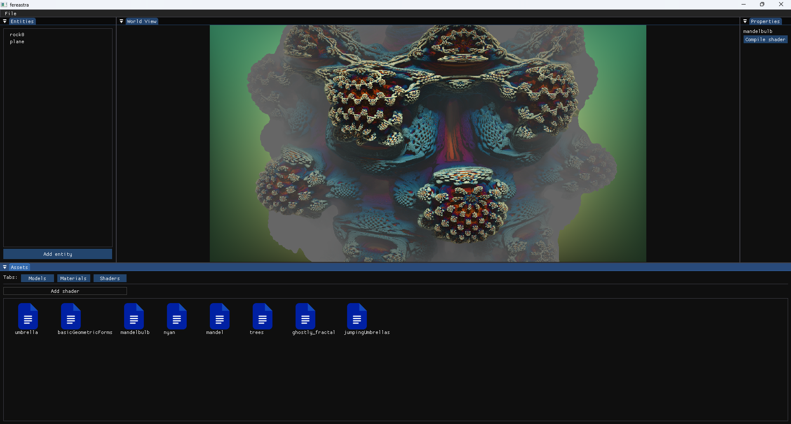

# free us engine

Free us engine is a raymarching shader engine we built on top of GLtest, for a hackathon in Timisoara.

## Description

The engine features the ability to create raymarching glsl shaders and compile them at runtime.

There are some default preview shaders(ported from shadertoy) already present in the shaders tab. In order to create new shaders, a project must be created through the 'File' menu. Every project has a '.sor' file that can be used to load it at any time.

The example code for the preview shaders is located in engine/ourShaders.

## Getting Started

### Dependencies

* Linux or Windows.
* Anything that handles cmake files.
* Opengl 4.6 
* Any c++ 20 compiler

### Building and executing

* The application can be built directly with the use of cmake, or within an IDE like Clion or Visual Studio.
* Depending on the OS, cmake may run unsuccessfully at first and mention what missing packages it needs.
* After the build is complete, the engine can be started directly by the IDE, or by running the executable generated inside the editor project. ( ex. editor.exe on Windows )

## Authors

* [sorinM2](https://github.com/sorinM2)
* [xaleamo](https://github.com/xaleamo)
* [Alex9alexandra](https://github.com/Alex9alexandra)
* [anarebeca](https://github.com/anaarebeca)
* [deniisa](https://github.com/deeniisaa)

## Acknowledgments

### ported preview shaders
* [cartoon fractal](https://www.shadertoy.com/view/XsBXWt)
* [tree fractal](https://www.shadertoy.com/view/llXfRr)
* [mandelbulb](https://www.shadertoy.com/view/MdXSWn)
* [mandelbrot](https://www.shadertoy.com/view/4df3Rn)

* umbrella shaders were made by [xaleamo](https://github.com/xaleamo)

### libraries
* [glfw](https://github.com/glfw/glfw)
* [glm](https://github.com/icaven/glm)
* [assimp](https://github.com/assimp/assimp)
* [imgui](https://github.com/ocornut/imgui)

## Mentions

Preview shaders are ported from shadertoy.

Since this was made for a hackathon, and we built it on top of a existing project, there are some redundant features that don't do anything.